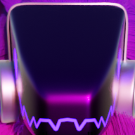

Test newspost

Hi

This is a test newspost

# Here's my figma window copied as text

farsand.com
b1.4
Home
About
Rules
News
Staff Team
Contact
Welcome to the website for FARSAND, the evolutionary Minecraft server. Starting from b1.3, we’ll be updating one version every month until we reach the latest version available!
Getting started
join our
Discord Community
We recommend using MultiMC, though you can also do the following in other launchers! To start with, add the following line to your JVM arguments to fix skins and sounds in beta: 
About the server
Support on Patreon
-Dhttp.proxyHost=betacraft.uk
We recommend the betacraft.uk proxy, check out their website to learn more about their server and software!
Next, create an instance and make sure to run b1.4, else you won’t be able to connect! After joining. use /register and input a nice password, and you’re good to go! Make sure to check upstairs in the spawn house and have fun!
News
Hello b1.4!
We’ve upgraded to b1.4! Learn what’s new here!
1st April, 2024
Support & Suggestions
Need help? Got a cool idea? Feel free to contact us anytime through the Discord Server, or email us directly at admin@farsand.com!
Our team
Let’s take a moment to look at the team behind FARSAND!
Map
19th March, 2024
Hello world!
FARSAND has finally launched! Learn all about the server and how to get started!
19th March, 2024